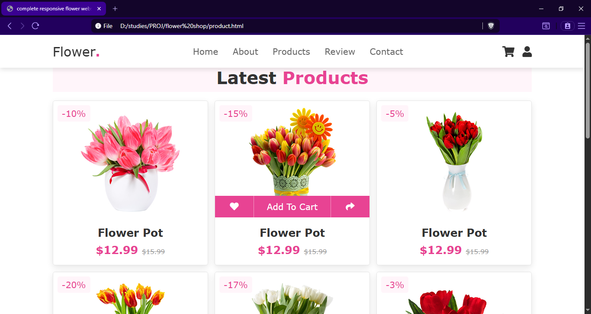
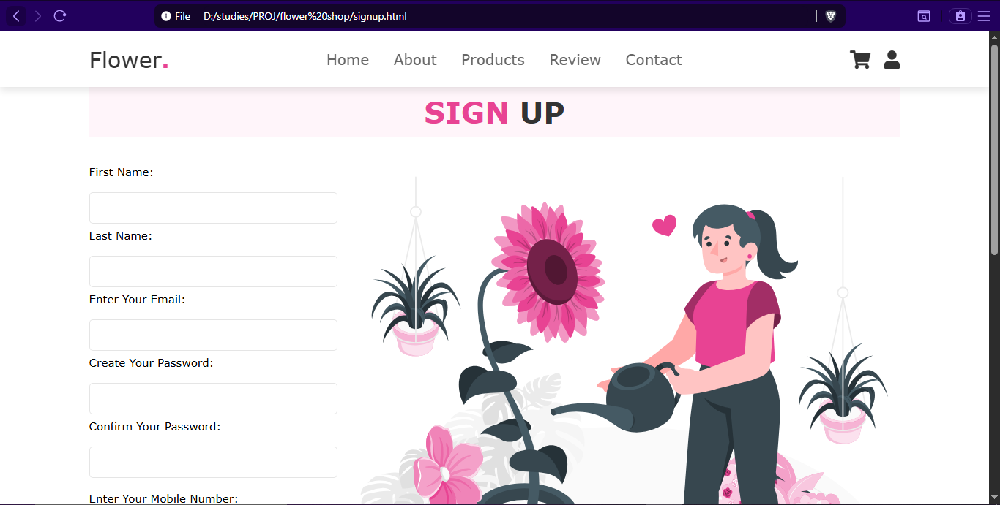
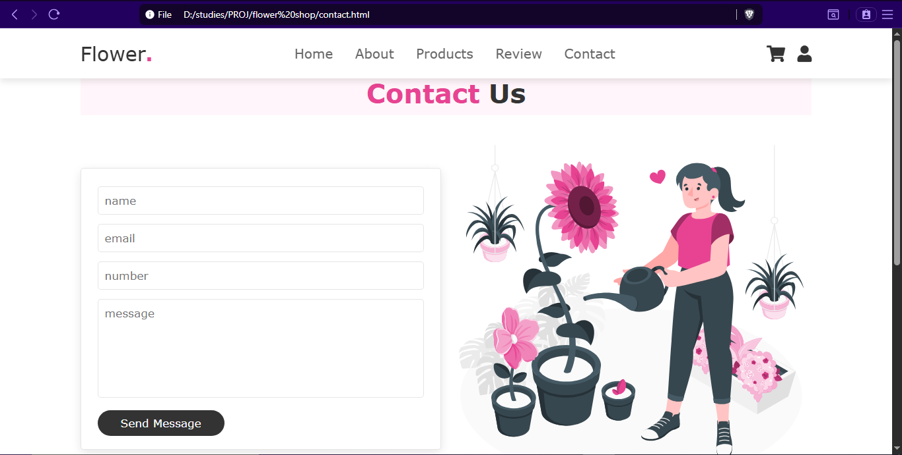
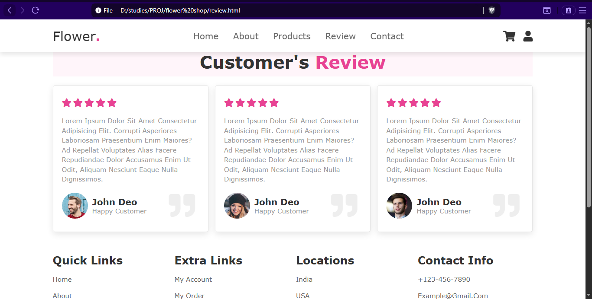
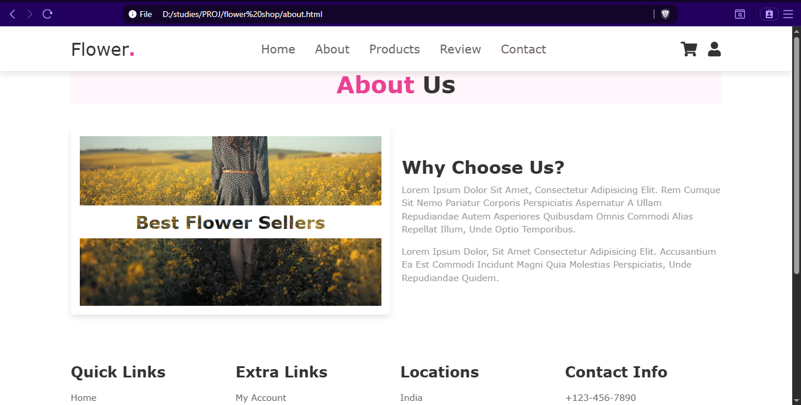

# 🌸 Flower Shop Website

This is a modern flower shop website where customers can browse flowers, view details, and place orders online.  
This project demonstrates **front-end web development** skills using HTML, CSS, and JavaScript, along with a clean, responsive UI design.

---
## 📸 Screenshots
Home page

Cart

Signup page

Contact page

Review page

About page


---

## ✨ Features

- 🌼 Browse flowers by category or search for specific items
- 🛒 Add products to cart and view product details
- 🔎 Product search and filter
- 📱 Fully responsive design for desktop and mobile
- 🔐 Login and signup pages for user authentication
- 📄 About, contact, and review pages
- 💻 Dynamic interactivity with JavaScript

---

## 🛠 Tech Stack

- **Frontend:** HTML, CSS, JavaScript
- **Images & Media:** Local folder
- **No backend / database** (static website project)

---
## 🚀 Getting Started

1. Clone the repository:
   ```bash
   git clone https://chamudithadev.github.io/flower-shop/

---
## 🔮 Future Improvements
- Add a backend to handle orders
- Integrate payment gateway
- Add user profiles and order history

---

